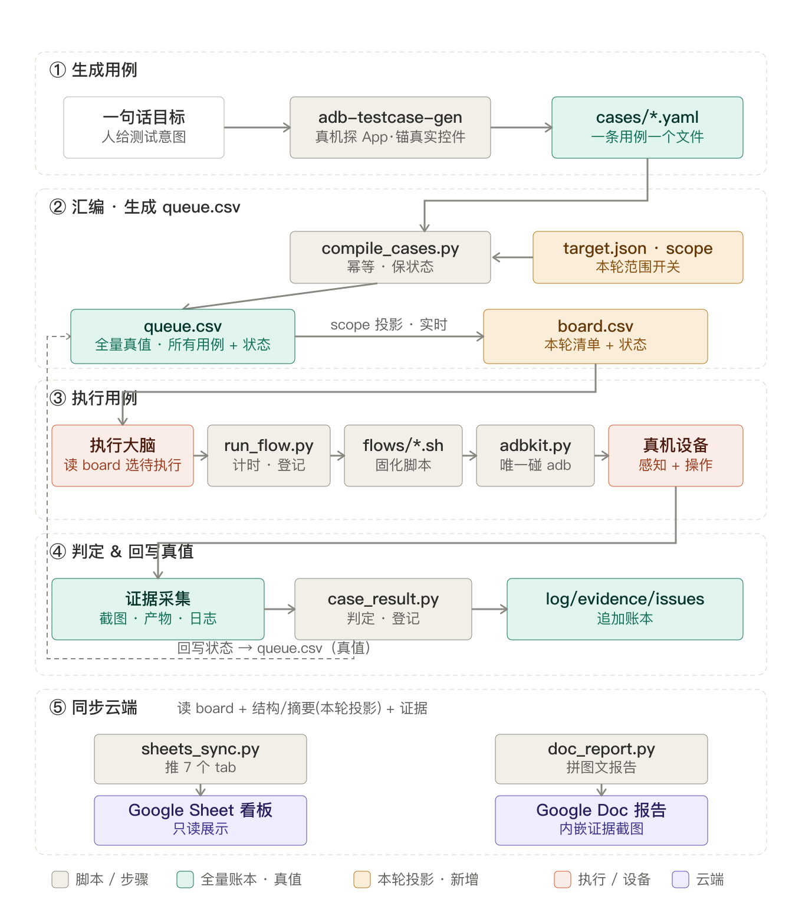

# AI 自动化测试（最小复刻）

AI 当测试工程师、用 ADB 驱动安卓模拟器的自动化测试框架。**Claude Code 当执行大脑**，
本地 CSV 当账本，Google Sheets 当云端看板。

## 组成

- `tools/adbkit.py` —— 手和眼：ADB 封装。感知 `ui/find/waitfor/focus`；操作 `tapid/taptext/tapdesc`（选择器点击，坐标现算跨分辨率，`--from` 复用 dump、`--timeout` 等待重试）+ `tap/text/key/swipe`；清障 `dismiss`(单弹窗) / `sweep`(通用广告&权限&系统弹窗清障，规则库驱动，见下)；证据 `shot/logscan`(按PID过滤)/`output-check`(查MediaStore)/`alarm/db/sp`；`--serial` 多设备。
- `config/ad_rules.json` —— 通用广告/弹窗**清障规则库**（跨 App 通用、随仓库版本管理）。每条规则 = `作用页(scope) + 命中选择器(match) → tap_matched`。`adbkit.py sweep` 读它：认当前前台页 → dump 一次 → 命中就点，幂等且尽力而为（没广告不算失败，始终 exit0；连续 `--patience` 轮无命中即收工）。广告关闭类靠 scope 卡在对应 SDK 全屏页才动手（不误伤正常界面），权限/系统弹窗类作用页为任意页面。加新规则先 `adbkit.py focus` 看目标页的组件串定 scope。调用时机由执行大脑掌握（进广告位后 / 步骤之间兜底）。
- `tools/compile_cases.py` —— 把 `apps/<slug>/cases/*.yaml` 汇编进 `queue.csv`（幂等，保留运行时状态）。
- `tools/init_target.py <包名>` —— 换被测 App 时，只给包名自动探测 `serial`/`app_version`/`main_activity`/`build`(debuggable 判定)/`db_name` 并生成/更新 `config/target.json`（默认只打印不落盘，`--write` 才写回；`app_name`/`app_version` 要人工核对再确认，见 `docs/gotchas.md`）。
- `apps/<slug>/flows/flow_cut_save.sh` —— 示例：把一条用例编译成纯选择器的可执行流程，按 serial 参数化，可多设备并行。
- `tools/sheets_sync.py` —— 把账本推到 Google Sheets。
- `tools/doc_report.py` —— 把账本 + 证据截图渲染成一份 **Google Doc 图文报告**（指标概览 / 执行清单 + 状态追踪 / 结构覆盖 / 问题清单 / 内嵌截图 / 变更时间线）。用 OAuth（你本人授权），Doc 与截图都归你所有。
- `apps/<slug>/cases/*.yaml` —— 用例定义；由 skill `adb-testcase-gen` 从一句话目标生成。`_TEMPLATE.yaml` 是通用字段模板；`CUT-CORE-01.yaml` 是唯一保留的 **MP3 Cutter 示例**（跑通给你看完整流程用的，换被测 App 时替换/删除，见下）。仓库定位是通用框架，不带完整业务用例集——本机可以写自己的 `apps/<slug>/cases/*.yaml`，`.gitignore` 里已经排除了一份体量较大的示例回归集（`regression.yaml`），避免真实业务内容混进框架库。
- `apps/<slug>/ledger/*.csv` —— 账本（运行时真值）。`queue.csv` 是**全量真值**（所有用例 + 运行时状态）；`board.csv` 是按 `config/target.json` 的 `scope` 从 queue 投影出的**本轮清单**（看板/报告只显示本轮范围，见「本轮回归范围」一节），其余 CSV 对应看板各 tab。**本机执行产物，不进 git**（多人协作会冲突，团队共享真值是 Sheet），fresh clone 先跑 `python3 tools/compile_cases.py` 从 `apps/<slug>/cases/*.yaml` 重新汇编（会一并生成 board.csv）。
- `docs/RUNBOOK.md` —— 执行大脑的行动协议（**新会话先读它**）。
- `docs/structure.md` / `docs/gotchas.md` / `docs/decisions.md` —— 结构、已知坑、架构决策。

> ⚠️ Google Sheet 是**只读展示视图**（从 YAML 渲染）。要增删/改用例请在对话里说，由 Claude 改 `apps/<slug>/cases/*.yaml`；**别在表里手改**，会被下次同步覆盖。详见 `docs/decisions.md`。

## 数据流：从生成用例到执行

全量真值 `queue.csv` 经 `scope` 投影出本轮清单 `board.csv`；执行大脑对着本轮范围干活，判定后状态**回写 `queue.csv`**（真值），看板/报告只读本轮 `board`。



> 图源为 [docs/assets/dataflow.svg](docs/assets/dataflow.svg)，改图后用 `rsvg-convert -z 2 docs/assets/dataflow.svg -o docs/assets/dataflow.png` 重新导出 PNG。

关键闭环是 `queue.csv ⇄ board.csv`：状态真值永远在全量 `queue.csv`，`board.csv` 只是它按 `scope` 过滤出的、随时可重建的本轮投影——所以缩放范围不丢状态，看板也不会被范围外用例干扰。

## 用例的执行机制

「执行一条用例」有两种机制，由该用例 `固化脚本` 列（YAML 的 `frozen_script` 字段）决定走哪条：

| 机制 | 怎么跑 | 特点 | 何时用 |
|---|---|---|---|
| **① 固化脚本** | `run_flow.py <ID> apps/<slug>/flows/xxx.sh` | 纯选择器、无 AI 逐屏推理，快、可多设备并行；自动计时 + 登记 | 已探通并固化过脚本、UI 没变 |
| **② 主循环逐屏** | 用 `adbkit.py` 一屏屏 `ui→tap→shot→logscan` 探路 + 采证 | 慢但健壮，能应对没跑过 / UI 变了；也是固化脚本的来源 | `固化脚本` 列为空，或脚本跑挂要回退重探 |

> **硬规则**：跑固化脚本一律走 `run_flow.py`，绝不裸 `bash apps/<slug>/flows/xxx.sh`（否则 `log.csv`/`queue.csv` 不留痕）。无论哪种机制，通过/失败判定都要人工看 `output-check`/`logscan` 后补一行登记。

与「执行机制」正交的是**范围口径**（一次跑多少）：跑单条 / 跑本轮全部（从 board 范围内挑待执行，一条条到没有待执行为止——"待执行"以 `queue.csv` 实时状态为准）/ 重跑某条。「本轮」由 `scope` 框定，见下方「本轮回归范围」。

## 快速开始

```bash
# 1. 配置被测 App
cp config/target.example.json config/target.json
#   编辑：package / db_name / （多设备时）serial / sheet_id / （可选）scope 本轮范围

# 2. 连上模拟器，确认可用（App 需 debuggable 才能导 DB/SP）
adb devices
python3 tools/adbkit.py devices

# 3. 冒烟试一下手和眼
python3 tools/adbkit.py launch
python3 tools/adbkit.py --case SMOKE-01 ui  step1     # 打印控件树 + 存 XML
python3 tools/adbkit.py --case SMOKE-01 shot step1

# 4. 提供用例 → 写进 apps/<slug>/cases/*.yaml → 汇编进本机账本
python3 tools/compile_cases.py

# 5. 让 Claude Code 按 docs/RUNBOOK.md 跑主循环
# 6. 同步云端看板（配好凭证后）
python3 tools/sheets_sync.py
```

> fresh clone（新机器/新协作者）注意：`apps/<slug>/ledger/`、`assets/`（除 README）、`config/target.json` 等凭证文件都不进 git，是每人本机自备/生成的。本机自备真实音频素材（见 `assets/README.md`）→ `bash seeds/push_media.sh <serial>` 推到设备 → `python3 tools/preflight.py` 自检就位。

## 用例 ID 命名规则

`apps/<slug>/cases/*.yaml` 里每条用例的 `id` 字段遵循 **`模块前缀-子类别-序号`** 三段式（见 `apps/<slug>/cases/_TEMPLATE.yaml`），换被测 App 时也照这个模式起名：

- **模块前缀**：所属功能模块的英文缩写。如 `CUT` = 音频裁剪（Cut）、`MERGE` = 音频合并、`MIX` = 音频混合、`SPLIT` = 音频拆分。
- **子类别**：这条用例具体测什么方向，几个常见词：
  - `CORE` —— **核心路径**（happy path）：这个模块最基本、最主要的功能链路，回归里最该先跑通、最该稳定的一条（通常配 `category: 冒烟/核心路径`，是优先固化成 `apps/<slug>/flows/flow_*.sh` 冒烟脚本的候选）。
  - `EDGE` —— **边界/异常输入**（edge case）：故意喂给 App 不常见或超出常规范围的输入（如非标准采样率），验证异常分支的健壮性，不是主路径。
  - `FMT` —— **格式矩阵**（format）：同一功能在多种文件格式（mp3/wav/aac/flac/ogg 等）下是否都正常。
  - `COUNT` —— **数量边界**：输入数量在 0/1/多个/上限等边界值下的行为。
  - `RESULT` —— **结果页通用校验**：保存结果页的文件名/大小/时长等字段正确性，跨模块复用的校验清单。
  - `MODE` —— **模式/选项分支**：同一功能下不同保存模式/选项（如"保存所有片段" vs "保存为单一文件"）。
- **序号**：同一模块+子类别下的第几条，从 `01` 开始，全局（同一模块前缀内）唯一，不要撞车。

例：`CUT-CORE-01` = 音频裁剪模块的核心路径用例第 1 条；`CUT-EDGE-01` = 音频裁剪模块的边界/异常输入用例第 1 条。新起子类别词不强制局限于上面这几个，只要在 `apps/<slug>/cases/*.yaml` 里保持"一眼看出测的是什么方向"就行。

## 换一个被测 App（框架复用）

`apps/<slug>/cases/CUT-CORE-01.yaml`、`apps/<slug>/flows/flow_cut_save.sh` 是 MP3 Cutter 的最小示例，留着给你看一条用例从定义到固化脚本的完整跑法。换新 App 时：

1. 删掉/替换这两个文件（`apps/<slug>/cases/_TEMPLATE.yaml` 留着，是通用模板）。
2. `config/target.json` 里换 `package`/`db_name`/`serial` 等指向新 App。
3. 用 skill `adb-testcase-gen`（或直接对话说测试目标）重新生成 `apps/<slug>/cases/*.yaml`。
4. 稳定路径再按 `docs/flow-freeze.md` 固化成新的 `apps/<slug>/flows/flow_*.sh`。

## 本轮回归范围（scope / board.csv）

一次回归不一定跑全量。`config/target.json` 的 `scope` 字段框定本轮范围：

- 留空 = 全量；
- 一组优先级：`"P0"` 或 `"P0,P1"`；
- 一组用例ID：`"CUT-CORE-01,CUT-EDGE-01"`；
- 优先级与用例ID 不能混写，写错/写不存在的会直接报错（不会静默变空）。

`compile_cases.py` 按 scope 从全量 `queue.csv` 投影出 `board.csv`（本轮清单，执行顺序号重编 1..N）。**全量真值永远在 `queue.csv`，不受 scope 影响**；看板「测试队列」tab、Doc 报告、结构/摘要都读 board，只显示本轮，避免"只回归 P0 却看到一堆待回归用例"的迷惑（报告顶部带「本轮范围：P0,P1（8/全量14）」声明防反向误解）。改范围只需编辑 scope 再 compile/sync；放宽范围不丢状态（历史都在 queue）。详见 `docs/RUNBOOK.md`「本轮范围」节与 `docs/decisions.md` #17。

## Google Sheets 同步（可选，云端看板）

一次性：
1. GCP 项目启用 Google Sheets API（✅ 已完成）。
2. 建服务账号 → 生成 JSON 密钥 → 存 `config/service_account.json`。
3. 目标 Sheet 共享给服务账号邮箱（`*@*.iam.gserviceaccount.com`）为 Editor。
4. `pip3 install gspread google-auth`，并在 `config/target.json` 填 `sheet_id`。

不配也能跑，只是账本停在本地。

## Google Doc 图文报告（可选，`doc_report.py`）

Sheet 适合看表格；要一份带**内嵌截图**的图文报告（发人看/存档），用 `doc_report.py`。

> ⚠️ 为什么这里用 OAuth 而不是服务账号：Docs API 插图只收「可公开抓取的 URL」，本地 PNG 得先传 Drive；
> 而**服务账号无 Drive 存储配额**，上传即 403（跟当初 SA 不能建表同源）。用你本人的 OAuth 授权，
> 图片进你自己的 Drive、Doc 也由你自动新建，省掉手动建 + 共享。

一次性：
1. GCP 项目**启用 Google Docs API + Google Drive API**。
2. 建 **OAuth 客户端 ID（类型：桌面应用）** → 下载 JSON → 存 `config/oauth_client.json`。
3. 同意屏幕把 `xxtester2026@gmail.com` 加为**测试用户**。
4. `pip3 install --user google-api-python-client google-auth-oauthlib`。

```bash
python3 tools/doc_report.py              # 首次弹浏览器授权，之后无人值守；自动新建 Doc 并回填 doc_id
python3 tools/doc_report.py --no-images  # 只出文字版（快、省配额）
python3 tools/doc_report.py --new        # 另建一份新 Doc
```

覆盖式刷新（同 sheets_sync）：既存 Doc 先清空再重画，**别在 Doc 里手改**。生成后会把链接回写进 `summary.csv`，
再跑 `sheets_sync.py` 即可让看板摘要也带上 Doc 链接。

## 云端账号与多账号切换（oauth_account）

`new_run` 建表、`doc_report` 建 Doc / 传证据图，都用 **OAuth（你本人授权）**——因为服务账号(SA)无 Drive 配额、不能建文件（SA 只负责 sheets_sync 往已建好的表里写数据）。OAuth token 按账号存成 `config/oauth_token.<account>.json`，`target.json` 的 `oauth_account` 字段选用哪个：

- 留空 = `config/oauth_token.json`（默认单账号）
- 填 `<acct>` = `config/oauth_token.<acct>.json`（如 `inshot` → `oauth_token.inshot.json`）

多个账号的 token **可以共存**，切换只改 `oauth_account`、**不用重新授权**（前提该账号 token 已授权存在）。

**换成一个新账号**（含企业 Workspace 账号）：
1. GCP OAuth 同意屏幕把新账号加为**测试用户**；
2. 改 `oauth_account`（或删对应 token 文件）→ 下次跑 `new_run`/`doc_report` 弹浏览器用新账号授权；
3. **旧账号建的产物新账号访问不到**——把 `target.json` 的 `doc_id`/`image_folder_id` 清空让脚本在新账号 Drive 重建；`sheet_id` 那张旧表 SA 仍能写（归属仍是旧账号），想让表也归新账号得 `new_run` 重建。

> 企业 Workspace 账号还要过两关：管理员允许第三方 OAuth 应用、允许向外部 SA 邮箱共享。凭证一律不进 git（`.gitignore` 用 `config/oauth_token*` 通配）。

## 证据类型说明

`apps/<slug>/ledger/evidence.csv` 的"证据类型"列记录每一条证据是怎么采到的、能证明什么，对应 `adbkit.py` 的不同子命令：

| 证据类型 | 采集命令 | 是什么 / 能证明什么 | 是否要求 debuggable |
|---|---|---|---|
| `screenshots` | `shot` | 界面截图，验证 UI 呈现是否符合预期（页面文案、控件状态、结果提示等） | 否 |
| `MediaStore` | `output-check` | 查询 **Android 系统级媒体索引库**（`content://media/external/audio/media`，不是 App 自己的数据），验证音频/视频等产物是否真的生成、`_size`/`duration` 是否合理（`--expect` 命中后默认带完整性检查）、路径（`_data`）是否符合预期。系统公共 provider，`adb shell` 直接能查，不需要 `run-as` | 否——非 debug 包也能用，是本项目验证"产物确实生成且正确"的主要黑盒手段 |
| `logs` | `logscan` | 按 App 进程 PID 过滤的 logcat 崩溃扫描，验证有无 FATAL / ANR / AndroidRuntime / SQLiteException / NativeCrash | 否 |
| `playback` | `playback`（待实现）| dump 播放运行时态验证"正在播放"而非卡首帧/暂停/静音——**过程类 App**(视频/音频播放器)的核心手段，补 `output-check`(只验落地产物)覆盖不到的"过程在推进"。flag 按数据源命名可组合：`--session`(`dumpsys media_session`，断言 `state=PLAYING`+`position` 两采样递增=推进)、`--audio`(`dumpsys audio`，断言 player 状态=`started`=出声)。与 `alarm` 同族(dumpsys 状态快照)。详见 `docs/evidence-video-playback.md` | 否——`dumpsys` 走 `adb shell` 即可，非 debug 包也能取 |
| `screenshots`（复用，命令 `framediff`）| `framediff`（待实现）| **视频区帧差**:裁剪画面区后隔 N 秒连拍 2–3 张 `screencap`，算像素差+单帧有效性——帧差>阈值=在渲染、≈0=首帧冻结、纯黑=黑屏。专治"截一张看不出动没动"。产物是截图故归 `screenshots`，但采集命令另写(`shot` 只存单张不算差)。**注意** `screencap` 对 SurfaceView/DRM 视频可能全黑 → 用前先验。详见 `docs/evidence-video-playback.md` | 否——`screencap` 无需 debuggable |
| `db` | `db` | 导出 App 私有 SQLite 数据库做前后 diff，验证数据是否正确写入、有没有被污染/覆盖 | 是（需 `run-as`） |
| `sp` | `sp` | 导出 App 私有 SharedPreferences，验证开关位/配置字段是否符合预期 | 是（需 `run-as`） |
| `privls` | `privls` | 列出 App 私有存储目录（内部 `files/` 或外部专属目录），常配合操作前后 diff，用于验证"下载/输出落在私有目录而非 MediaStore"这类场景 | 是（需 `run-as`） |
| `alarm` | `alarm` | 检查提醒/闹钟排程状态，验证系统级 reminder 是否真正设置/取消 | 视具体实现而定 |

判定优先级：非 debug 包（大多数 release 包）只能用 `screenshots`/`MediaStore`/`logs`/`playback`/`framediff`，`db`/`sp`/`privls` 这三类需要 App 是 debuggable 才能用 `run-as` 读到。详见 `docs/RUNBOOK.md`「判定要读多源」和「`证据类型=MediaStore` 具体包含哪些情况」两节；视频播放器类 App 的完整证据链见 `docs/evidence-video-playback.md`。

**`UI XML`（不是独立证据类型，是合并标注）**：`ui <step>` 会把这次 uiautomator 控件树 dump 存进 `evidence/.../ui/<step>.xml`——控件文本/resource-id/bounds 都在里面，是断言里精确数值（比如具体时长）的原始依据。写断言时如果真的引用了这份 dump 数据（不是纯看截图写的），`shot` 加 `--used-dump`，`_append_evidence` 就把这行的"证据类型"写成 `screenshots+UI XML`（**不拆成两行**，"文件/链接"列仍只放截图路径——XML 按约定路径能推出来，不重复登记）。**这是显式声明，不是自动检测**——「dump 有没有喂给这条判断」只有写断言的人自己知道，同名 XML 文件存在不代表就用上了（可能只是导航用的 dump），所以不按文件存在与否去猜。只单独 `ui` 没有配套 `--used-dump` 的 `shot` 的那次 dump 不会进账本（纯定位用，见 `docs/decisions.md` #20）。
